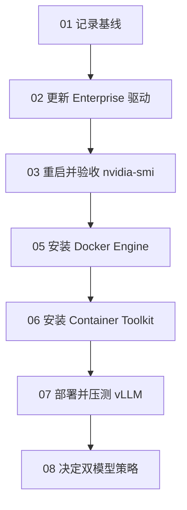

# Windows + WSL2 双模型部署教程（总览与目录）

> 面向机器：RTX 6000 Ada 48GB · Windows + WSL2 Ubuntu 24.04  
> SSH：`ssh jacky-win`（Windows）· `ssh jacky-wsl`（WSL）  
> 学习目标：你亲手完成驱动 → Docker → GPU 容器 → vLLM，并理解每一步「为什么」。

---

## 1. 背景（先读懂再动手）

你要在同一台工作站上部署两个大模型：

| 角色 | 模型（候选，部署前再确认） | 量化 | 框架 |
|------|---------------------------|------|------|
| 通用 Agent | `Qwen/Qwen3.6-27B-FP8`（或 `Qwen3.5-27B-FP8`） | FP8 | vLLM |
| 编程 | `Qwen/Qwen3-Coder-30B-A3B-Instruct-FP8`（备选 AWQ） | FP8 / AWQ | vLLM |

当前已知状态：

- Windows NVIDIA 驱动：**552.12**（CUDA 兼容上限约 **12.4**）
- Windows 与 WSL **均已识别 GPU**
- **尚未**安装 Docker、NVIDIA Container Toolkit
- GPU 目前空闲，适合先改驱动再装栈

### 为什么建议先更新驱动？

- **保持 552.12**：仍可装 Docker / Ollama，也能用 **CUDA 12.4 兼容** 的 vLLM 镜像，但新内核与新 PyTorch/vLLM 会更受限。
- **更新到 RTX Enterprise Production Branch**：后续更稳妥地使用 **CUDA 12.6 / 12.8** 推理镜像，减少 FP8、PyTorch、vLLM 的版本卡点。

结论：**驱动更新强烈建议，但不是「今天完全不能部署」的硬前提。** 本教程按「先更新再装 Docker」的合理顺序写；若你决定暂不更新，跳过 [02](02-更新Windows-NVIDIA驱动.md)，在 [07](07-vLLM部署与压测.md) 选用 CUDA 12.4 兼容镜像即可。

### 架构一句话

```text
Windows 装 NVIDIA 驱动（真正管 GPU）
        ↓ 透传
WSL2 Ubuntu 24.04（nvidia-smi 能看到同一张卡）
        ↓
Docker Engine + NVIDIA Container Toolkit
        ↓
vLLM 容器（--gpus all）跑模型，对外提供 OpenAI 兼容 API
```

**关键铁律**：GPU 驱动装在 **Windows**；WSL **不要**再装 Linux 版 `nvidia-driver`，否则容易把透传搞坏。

---

## 2. 推荐操作顺序



---

## 3. 目录（按顺序学习）

| 步骤 | 文档 | 你会学会什么 |
|------|------|--------------|
| 00 | **本页** | 背景、架构、总验收清单 |
| 01 | [环境现状与验收基线](01-环境现状与验收基线.md) | 如何用命令「拍照」当前状态 |
| 02 | [更新 Windows NVIDIA 驱动](02-更新Windows-NVIDIA驱动.md) | 去哪下、选哪个分支、为什么 |
| 03 | [重启后 Windows 与 WSL 验收](03-重启后Windows与WSL验收.md) | 双端 `nvidia-smi` 如何判成功 |
| 05 | [WSL 安装 Docker Engine](05-WSL安装Docker-Engine.md) | 为何用 Engine 而不是 Desktop |
| 06 | [安装 NVIDIA Container Toolkit](06-安装NVIDIA-Container-Toolkit.md) | 容器如何真正用到 GPU |
| 07 | [vLLM 部署与压测](07-vLLM部署与压测.md) | 拉镜像、起服务、`curl` 压测 |
| 08 | [双模型显存策略](08-双模型显存策略.md) | 常驻一个还是按需切换 |
| 附录 | [命令速查与故障表](附录-命令速查与故障表.md) | 复制粘贴用的速查表 |

---

## 4. 学习约定（像上课一样）

1. **每步做完先验收**：文档里的「验收」不过关，不要跳下一步。
2. **记下输出**：尤其是 `nvidia-smi`、驱动版本、报错全文——回来提问时直接贴。
3. **模型 ID 可改**：总览里的 Hugging Face ID 是候选；你最终选定后，把 ID 写进 [07](07-vLLM部署与压测.md) 的启动命令即可。
4. **国内网络**：HF 慢时可用 ModelScope / 镜像；文档会提示环境变量写法。

---

## 5. 总验收清单（全部做完应全部勾上）

- [ ] Windows `nvidia-smi` 显示新驱动（或你明确选择保留 552.12）
- [ ] WSL `nvidia-smi` 与 Windows 驱动版本一致、能看到 RTX 6000 Ada
- [ ] WSL 内 `docker run hello-world` 成功
- [ ] `docker run --gpus all ... nvidia-smi` 在容器内成功
- [ ] vLLM 至少一个模型可 `curl` 出回复
- [ ] 已按 [08](08-双模型显存策略.md) 选定「常驻」或「切换」策略

---

## 6. 下一步

从这里开始 → **[01 - 环境现状与验收基线](01-环境现状与验收基线.md)**
