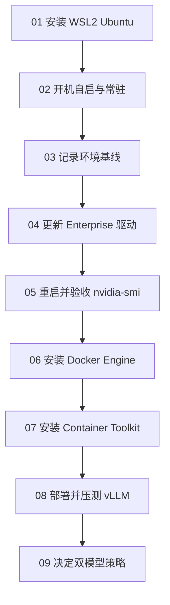

# Windows + WSL2 双模型部署教程（总览与目录）

> 面向机器：RTX 6000 Ada 48GB · Windows + WSL2 Ubuntu 24.04  
> SSH：`ssh jacky-win`（Windows）· `ssh jacky-wsl`（WSL）  
> 学习目标：从安装 WSL、无人值守常驻，到驱动 → Docker → GPU 容器 → vLLM，并理解每一步「为什么」。

---

## 1. 背景（先读懂再动手）

你要在同一台工作站上部署两个大模型：

| 角色 | 模型（候选，部署前再确认） | 量化 | 框架 |
|------|---------------------------|------|------|
| 通用 Agent | `Qwen/Qwen3.6-27B-FP8`（或 `Qwen3.5-27B-FP8`） | FP8 | vLLM |
| 编程 | `Qwen/Qwen3-Coder-30B-A3B-Instruct-FP8`（备选 AWQ） | FP8 / AWQ | vLLM |

同时希望这台机器能作为 **共享 GPU 节点**：Windows 可供本机用户使用，Linux 服务跑在 WSL2；开机后即使停在登录界面，远端也能经 Tailscale SSH 进 WSL。

当前已知状态（以你机器为准，用 [03](03-环境现状与验收基线.md) 再拍基线）：

- Windows NVIDIA 驱动可能仍是 **552.12**（CUDA 兼容上限约 **12.4**）
- 若已装好 WSL/驱动：Windows 与 WSL 应能识别同一张 GPU
- Docker / NVIDIA Container Toolkit / vLLM 按后续章节安装

### 为什么建议更新驱动？

- **保持 552.12**：仍可装 Docker，也能用 **CUDA 12.4 兼容** 的 vLLM 镜像，但新内核与新 PyTorch/vLLM 会更受限。
- **更新到 RTX Enterprise Production Branch**：后续更稳妥地使用 **CUDA 12.6 / 12.8** 推理镜像。

结论：**驱动更新强烈建议，但不是硬性前提。** 若暂不更新，跳过 [04](04-更新Windows-NVIDIA驱动.md)，在 [08](08-vLLM部署与压测.md) 选用 CUDA 12.4 兼容镜像即可。

### 架构一句话

```text
Windows 开机
    → 任务计划程序拉起 WSL（keeper: sleep infinity）
        → systemd（tailscaled / 日后 vllm…）
            → Docker + NVIDIA Container Toolkit
                → vLLM（--gpus all）OpenAI 兼容 API

GPU 驱动只装在 Windows，经 WSL 透传；不要在 WSL 装 Linux nvidia 驱动。
```

---

## 2. 推荐操作顺序



若 WSL 与无人值守已就绪，可从 [03](03-环境现状与验收基线.md) 起读；共享 GPU 节点仍建议补做 [02](02-开机自启与WSL常驻.md) 的 Test 4。

---

## 3. 目录（按顺序学习）

| 步骤 | 文档 | 你会学会什么 |
|------|------|--------------|
| 00 | **本页** | 背景、架构、总验收清单 |
| 01 | [安装 WSL2 与 Ubuntu](01-安装WSL2与Ubuntu.md) | 发行版安装、systemd、与 WSL 运行时分层 |
| 02 | [开机自启与 WSL 常驻](02-开机自启与WSL常驻.md) | 任务计划、keeper、Tailscale、无人登录验收 |
| 03 | [环境现状与验收基线](03-环境现状与验收基线.md) | 用命令「拍照」当前 GPU/系统状态 |
| 04 | [更新 Windows NVIDIA 驱动](04-更新Windows-NVIDIA驱动.md) | 去哪下、选哪个分支、为什么 |
| 05 | [重启后 Windows 与 WSL 验收](05-重启后Windows与WSL验收.md) | 双端 `nvidia-smi` 如何判成功 |
| 06 | [WSL 安装 Docker Engine](06-WSL安装Docker-Engine.md) | 为何用 Engine 而不是 Desktop |
| 07 | [安装 NVIDIA Container Toolkit](07-安装NVIDIA-Container-Toolkit.md) | 容器如何真正用到 GPU |
| 08 | [vLLM 部署与压测](08-vLLM部署与压测.md) | 拉镜像、起服务、`curl` 压测 |
| 09 | [双模型显存策略](09-双模型显存策略.md) | 常驻一个还是按需切换 |
| 附录 | [命令速查与故障表](附录-命令速查与故障表.md) | 复制粘贴用的速查表 |

---

## 4. 学习约定（像上课一样）

1. **每步做完先验收**：文档里的「验收」不过关，不要跳下一步。
2. **记下输出**：尤其是 `nvidia-smi`、驱动版本、报错全文——回来提问时直接贴。
3. **模型 ID 可改**：总览里的 Hugging Face ID 是候选；选定后写进 [08](08-vLLM部署与压测.md) 即可。
4. **国内网络**：HF 慢时可用 ModelScope / 镜像；文档会提示环境变量写法。

---

## 5. 总验收清单（全部做完应全部勾上）

- [ ] WSL2 + Ubuntu 已安装，`VERSION=2`，systemd 可用
- [ ]（共享节点）[02](02-开机自启与WSL常驻.md) Test 4：停在登录界面仍可远端进入 WSL
- [ ] Windows `nvidia-smi` 显示目标驱动（或明确保留 552.12）
- [ ] WSL `nvidia-smi` 与 Windows 驱动版本一致、能看到 GPU
- [ ] WSL 内 `docker run hello-world` 成功
- [ ] `docker run --gpus all ... nvidia-smi` 在容器内成功
- [ ] vLLM 至少一个模型可 `curl` 出回复
- [ ] 已按 [09](09-双模型显存策略.md) 选定「常驻」或「切换」策略

---

## 6. 下一步

从这里开始 → **[01 - 安装 WSL2 与 Ubuntu](01-安装WSL2与Ubuntu.md)**
